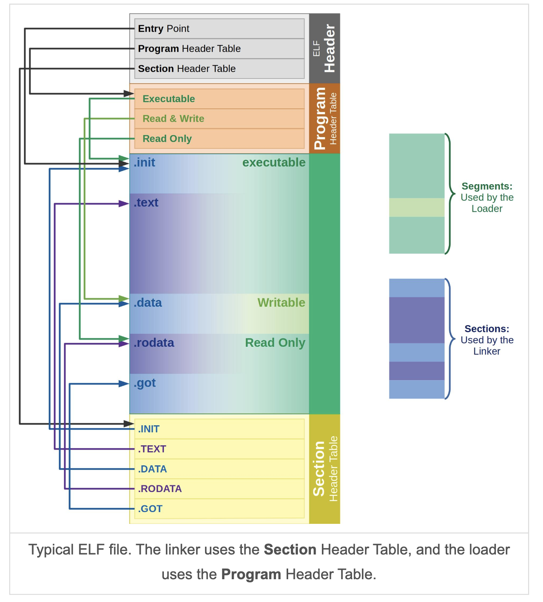

# Simple RISC-V Linker

This is a simple linker implementation that helps me learn how a linker works.

---

## ELF File Format Overview

*Image source: [ics.uci.edu](https://ics.uci.edu/~aburtsev/238P/hw/hw3-elf/hw3-elf.html)*

### 1. What is ELF?
- **ELF (Executable and Linkable Format)** is the file format used for `.o` object files in Linux.

### 2. Tools that Use ELF Files
- **Linker**: Combines multiple ELF files into an executable or a library.
- **Loader**: Loads the executable ELF file into the memory of a process.

### 3. Linker Requirements
- The linker needs to know the locations of sections like:
    - **DATA**
    - **TEXT**
    - **BSS**
    - Other relevant sections
- This information is necessary to merge them with sections from other libraries.

### 4. Loader Requirements
- The loader does not need section-level details.
- It only needs to know:
    - Which parts of the ELF file are **code** (executable).
    - Which parts are **data** and **read-only data**.
    - Where to place the **BSS** section in process memory.
- These permission restrictions are used to setup the **page table entries** while memory mapping in loader.

---

## ELF Header (**Ehdr**)

**Purpose:**  
The ELF header is the very first structure in an ELF file.  
It describes global properties of the file and tells both the loader and tools where to find other tables (program headers, section headers).

**Key fields:**
| Field       | Purpose |
|-------------|---------|
| `Ident`     | First 16 bytes, includes magic (`0x7F 'E' 'L' 'F'`) |
| `Machine`   | Target architecture (set this to `EM_RISCV`). |
| `Version`   | ELF version (usually `EV_CURRENT`). |
| `Entry`     | Entry point address |
| `Phoff`     | File offset of the program header table. |
| `Shoff`     | File offset of the section header table. |
| `Phentsize` / `Phnum` | Size and number of program header entries. |
| `Shentsize` / `Shnum` | Size and number of section header entries. |
| `Shstrndx`  | Index of `.shstrtab` in the section header table (section name string table). |

---

## Section Header (**Shdr**)

**Purpose:**  
Each section in the ELF file has a section header entry.  
These headers are **not used by the OS loader** at runtime but are essential for linkers and other tools to locate and interpret sections.

**Key fields:**
| Field       | Purpose |
|-------------|---------|
| `Name`      | Offset into `.shstrtab` (section name string table). |
| `Type`      | Section type |
| `Flags`     | Section attributes |
| `Addr`      |  |
| `Off`       | File offset of the section's data. |
| `Size`      | Size of the section in bytes. |
| `Link` / `Info` | |
| `Addralign` | Required memory/file alignment. |
| `Entsize`   | Size of each entry in the section (used for tables like `.symtab`). |

---

## ELF Section Header — `Type` vs `Flags`

### **Type**
- **Meaning:** Describes *what kind of data* the section contains and how tools should interpret it.
- **Common values:**
  - `SHT_PROGBITS` — Raw program data (e.g., `.text`, `.data`, `.rodata`).
  - `SHT_NOBITS` — No data in file, just memory space at runtime (e.g., `.bss`).
  - `SHT_SYMTAB` — Symbol table.
  - `SHT_STRTAB` — String table.
  - `SHT_RELA` / `SHT_REL` — Relocation entries.

### **Flags**
- **Meaning:** Describes *how the section behaves* and certain storage properties.
- **Common values:**
  - `SHF_ALLOC` — Section should be loaded into memory at runtime.
  - `SHF_EXECINSTR` — Contains executable code.
  - `SHF_WRITE` — Writable at runtime.
  - `SHF_MERGE` — Mergeable constants (identical fragments can be merged).
  - `SHF_STRINGS` — Contains NUL-terminated strings.

---

## Parsing Object Files

**After executing `NewObjectFile`, the linker finishes parsing the object file.**

---

## Ehdr Parsing

**Read Ehdr and verify magic number**
  - When an object file is opened, the linker enters `NewObjectFile`.
  - The first step is to parse the **ELF header (Ehdr)**.
  - Check the **magic number** (`0x7F 'E' 'L' 'F'`) in `Ehdr.Ident` to ensure this is a valid ELF file.

--- 

## Shdr Parsing

**Parse section headers**
  - If the ELF header is valid, read the **section header table** using:
    - `Ehdr.Shoff` → file offset of the section headers.
    - `Ehdr.Shnum` → number of section header entries.
  - This step loads the all the section headers into the object file structure.

--2. **Locate and read the section name string table** -- (Not done in this step!)
  - The index of the section name string table (`.shstrtab`) is stored in **`Ehdr.Shstrndx`**.
  - Use this index to find the `.shstrtab` section in the section header table.
  - Store the section name table into the object file structure.

---

## Symbol Table Parsing

1. **Locate the symbol table section**
  - Iterate through section headers and use the `Type` field to find the section with:
    - `SHT_SYMTAB` (regular symbol table)

2. **Parse and store symbols**
  - Once found, read the symbol table entries from the section’s file offset.
  - Store the parsed entries in `ObjectFile.ElfSyms`.
  - Also create self-defined symbol arrays and fill in the **File** field, so that MarkLiveObjects could be done in the next step.
  - A symbol element points to the place it stores (newed so in heap), and we **utilize context to point to undefined symbols other files (see figure)**.

3. **`Info` field — first global symbol index**
  - In the symbol table section’s header (`Shdr.Info`), the value represents the index of the **first global symbol**.
  - All symbols before this index are **local** symbols.

4. **`Link` field — associated string table**
  - In the symbol table section’s header (`Shdr.Link`), the value is the index of the section containing the **symbol name string table**.

5. **Symbol `Name` field — offset into string table**
  - Each symbol’s `Name` field stores an **offset** into the symbol name string table.
  - The actual symbol name is read from that offset up to the first `NUL` (`\0`) byte.

6. **Similarity between "Section Name String Table" and "Symbol Name String Table" and "Symbol Section Index Table"**
  - The first two are of type `SHT_STRTAB`, therefore we cannot use type to differentiate.
  - However, **symbol table** is the only section with type `SHT_SYMTAB` and that's why we use it to find symbol table.
  - (Not Necessarily Exists) **Symbol section index table** (I called it this name for better understanding) is also the only section with type `SHT_SYMTAB_SHNDX`

--- 

## MarkLiveObjects Function Implementation

**Goal:**  
Starting from the initially alive object files (direct `.o` inputs), iteratively pull in additional object files (usually members from archives) — until no more are needed.

### Algorithm (Queue-Based)

1. **Initialize queue**

2. Put all objects with `IsAlive == true` (direct inputs) into `roots`.

3. **Process until queue is empty**
    - Pop one object `F` from `roots`.
    - For every global symbol index `i` in `[F.FirstGlobal, F.TotalSyms)`:
        - Let `esym = F.ElfSyms[i]`, `sym = F.Symbols[i]`  
          (`esym` is original symbol data and `sym` is the structure we defined for ease)
        - If `esym` is **undefined** and `sym.File` (the defining file recorded in the global map) is not alive:
            - Mark `sym.File.IsAlive = true`.
            - Push `sym.File` into `roots`.

### Stop condition

When no new objects are added (i.e., `roots` becomes empty), the process is done.

---

## Symbol Section Index Table Parsing

After parsing the symbol table, we then parse the symbol section index table (not necessarily exists).

1. **Existence of Symbol Section Index Table**
- This table may or may not exist, and could be found using `SHT_SYMTAB_SHNDX` in the `type` field of shdr.

2. **Normal Case (No Extended Index)**
- If the table exists, we use the table to find the corresponding section index. If not, we simply use the `Shndx` field in a symbol.

---

## Input Sections Parsing

1. **Traverse Section Headers**
- Input sections parsing is done by iterating over every section header (`Shdr`) in the file.
- For each header, use its `Offset` and `Size` fields to locate and extract the section's raw data from the object file.

2. **Skip Non-Output Sections**
- Certain sections are **functional only** and are not needed in the final output binary.
- Examples:
    - Symbol table (`.symtab`)
    - Section name string table (`.shstrtab`)
- These are intentionally not parsed into `InputSection` objects to save memory and processing.

3. **Linking `Shdr` to `InputSection`
- Each `InputSection` retains a direct reference to its original `Shdr`.
- This is convenient because:
    - The section header already contains key attributes like type, flags, address alignment, etc.
    - Makes later linking stages simpler, since ELF metadata is always available with the section.

4. **Resolve or Create Output Sections**
- While parsing each `InputSection`, the linker also determines which **output section** it should belong to (one of input section's field).
- If the corresponding output section already exists, the input section is attached to it.
- If it does not exist yet, the linker creates a new output section on the fly.
- Note that **we don't put input sections into output sections in this step** because some are mergeable sections and would not stay in output section later (merged section instead).

---

## Mergeable Section Parsing

1. **Scan and Split**
    - Iterate over each `InputSection`.
    - If its `Shdr.Flags` contains `SHF_MERGE`, treat it as a **mergeable section**.
    - Split it into smaller **fragments** according to its content type for deduplication.
    - Note that we can view fragments just as input sections.

2. **One-to-One Mapping in `ObjectFile`**
    - `MergeableSections` array in `ObjectFile` has the same length as `InputSections`.
    - For a given index:
        - If it is mergeable, `MergeableSections[i]` will be set and `InputSections[i]` will be `inAlive`.
        - Otherwise, the entry remains in `InputSections` and the corresponding `MergeableSections[i]` is `nil`.

3. **Determine String vs Constant and Store Fragments**
    - Check if `Shdr.Flags` contains `SHF_STRINGS`:
        - **String table**: data consists of `\0`-terminated strings, split by nulls.
        - **Constants**: fixed-size items split according to `Shdr.Entsize`.
    - Mergeable section structure contains (all in array form):
        - Fragment offsets in the input section.
        - The actual string or constant bytes.
        - A `SectionFragment` object representing this piece.
    - (Design note) The original offset and actual bytes could be stored directly inside `SectionFragment` for better understanding.
    - That is, mergeable section could just keep `Fragments []*SectionFragment`.

4. **Meaning of `SectionFragment.Offset`**
    - Represents the offset **within the merged output section**.
    - Similar in concept to an `InputSection.Offset`, but on a smaller granularity.
    - Think of a `SectionFragment` as a "mini `InputSection`" that will be combined with others in the merged output section.

5. After this step, we collect **an array of fragment offsets and an array of fragments**, which will be used in the next step.

---

## Symbol Parsing

This step is done after input sections/mergeable sections are parsed so that the `inputSection`/`SectionFragment` field in a symbol could be filled.

1. **Undefined vs Absolute Symbols**
    - **Undefined symbol**: Declared in the current object but **defined in another object**.
        - Always **global** (only global symbols can be undefined across files).
        - During linking, relocations that reference it must be resolved to a definition found in some other object (or library).
    - **Absolute symbol**: **Belongs to no section** (`st_shndx = SHN_ABS`).
        - Its `st_value` is already the **final absolute address/value**.
        - Because it’s not section-relative, the symbol’s **InputSection is `nil`** in the internal representation.

2. Basically this step is used to **setup the input section/section fragment the symbols belong to**.

---

## UpdateFragmentOffsetAndMergedSectionSizeAlign and UpdateInputSectionOffsetAndOutputSectionSizeAlign

- Both input sections and fragments have **alignments and sizes**. We utilize these two fields to calculate the **sizes and alignments**
of output sections and merged sections. Output should always align to the **largest alignment of its component**.
- Note that we sort the fragments first and this can save spaces, preventing from leaving a lot of unused spaces (because of alignment).

---

## Sort Output Writers

- The output order is set as => ehdr, phdr table, notes, allocated sections, non-allocted sections, shdr table
- For allocated sections it is arranged in the order of => non-writable, executable, TLS, non-BSS

---

## SetOutputShdrOffsets

- The Shdr here does not mean the section header. It is just a borrowing of the structure to store attributes of an output writer.
- After the sizes and alignment of the output writers are confirmed, we can calculate the Addr and Offset and store it in Shdr.
- Offset will be used while copying to buffer.

---

## Create Phdrs
- Program segments are created and they include phdr, note, load, and TLS segments.
- Each load segment is ended until bss sections end. Non-allocated sections are not put into load segments.
- Note that TLS sections are loaded as well (except for tlbss), and a TLS segment is created so that a thread can rely on it to do copying/zeroing.

---

## CopyBuf
- Execute all the `CopyBuf` functions in output writers.
- Beside copying the content from input sections to the buffer, it also applies relocation to replace the undetermined addresses with correct addresses.

---

## Additional Notes

1. What fields are included in the symbol structure?
- Name (Which is the offset of the starting name string in symbol name string table)
- Value (Offset in the section)
- **Shndx** (Index of the section)
- There are more but these three are important.

2. What fields are in Ehdr?
- Magic Number
- Entry Point
- Shdr Table Offset and Shdr Numbers
- Phdr Table Offset and Phdr Numbers
- **Section Name String Table Index**

3. What fields are in Shdr?
- Offset (Start of Section)
- Type (program bits, no bits, symbol table, string table, relocation)
- Flags (alloc, write, merge, string)
- Address Alignment
- Size

4. **Overall Process**
- Parse Ehdr -> Find Shdr Table -> Parse Shdr -> Loop through shdr and find symbol table using type -> Parse symbols' name and file belonged & calculate fragment symbol value
- -> MarkLiveObjects -> Parse input sections -> Parse mergeable sections -> Parse symbols (setup input section/fragment)
- -> Sort fragments and calculate merged section size & align -> Calculate output section size & align                                            
- -> Create special writers and concat all writers -> Sort output writers -> Set output writers addresses and offsets
- -> Write output writers' contents using offset & fill in relocated symbols

5. **Debug Info (From ChatGPT)**
- .eh_frame => records registers, function length, etc., for a **user program** to know how to go back to the caller function, basically used in **try catch**
- .debug_frame => more detailed info for debugger usage

6. **About Linking (From ChatGPT)**
- Normally, Linking process uses the unit of **file**, therefore some unused functions could be possibly linked as well.
- However, there are some flags in GCC that can be used to optimize.

7. **About Global Variable Initializing**
- We can init a pointer variable using another variable's address since the address is resolved while linking
- However we can't init a normal variable using another variable's value, unless we use a constant.
- (Since we need to **load it first** but loading can only be done at runtime.)

8. **About TLS (From ChatGPT)**
- TLS data section will be loaded to memory as well and is used as a template for thread creation.
- Thread creation needs TLS phdr infos (e.g. memSize to setup tls bss).
- While accessing a thread-local variable, a **tp relative relocation (R_RISCV_TPREL_XXX)** will be generated, which is calculated as **S+A-TLS Segment Start**
- And the result is combined with a thread pointer to access the thread-local variable.

9. **Relocations**
- Relocation info (Rela struct) includes offset (within a section), type, and sym (symbol index in file)
- S is symbol address and P is current address (relocation points to)
- JAL imm => pc relative offset
- BRANCH imm => pc relative
- JALR imm => set (reg value + imm ) as absolute address
- Function call is a combination of auipc + jalr => pc relative
- R_RISCV_64 will be used when we do int *p = &extern_var
- For some TLS variables they have needs to use GOT to get their offsets from thread pointer. Therefore,
  linker has to create a GOT section and resolve the addresses of the entries.
- (Basically the assembly code will find the corresponding entry for the symbol and load it, and further use the loaded entry (stored offset) to load their thread local variables)
- (Therefore linker is responsible for creating the GOT and fill in the **entry address** of the symbols)

10. **PIC and NON PIC Code**
- Some **relative addresses can be confirmed during linking process**, for example, R_RISCV_JAL and R_RISCV_BRANCH.
- Non pic code can only run on specific addresses and pic code can be placed anywhere.

11. **Next Alignment Code**
- To do next alignment, we can do (value + alignment - 1) & (~(alignment - 1))