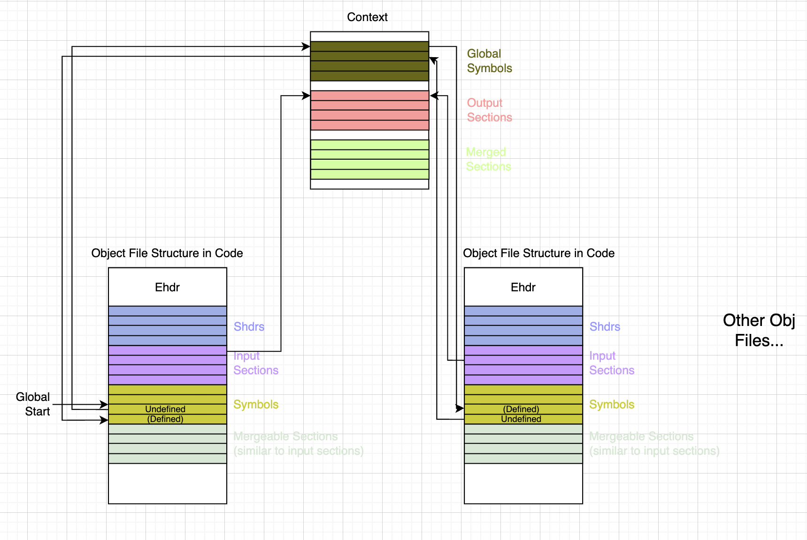

# Simple RISC-V Linker

This is a simple linker implementation that helps me learn how a linker works.

---

## ELF File Format Overview

*Image source: [ics.uci.edu](https://ics.uci.edu/~aburtsev/238P/hw/hw3-elf/hw3-elf.html)*

### 1. What is ELF?
- **ELF (Executable and Linkable Format)** is the file format used for `.o` object files in Linux.

### 2. Tools that Use ELF Files
- **Linker**: Combines multiple ELF files into an executable or a library.
- **Loader**: Loads the executable ELF file into the memory of a process.

### 3. Linker Requirements
- The linker needs to know the locations of sections like:
    - **DATA**
    - **TEXT**
    - **BSS**
    - Other relevant sections
- This information is necessary to merge them with sections from other libraries.

### 4. Loader Requirements
- The loader does not need section-level details.
- It only needs to know:
    - Which parts of the ELF file are **code** (executable).
    - Which parts are **data** and **read-only data**.
    - Where to place the **BSS** section in process memory.
- These permission restrictions are used to setup the **page table entries** while memory mapping in loader.

---

## ELF Header (**Ehdr**)

**Purpose:**  
The ELF header is the very first structure in an ELF file.  
It describes global properties of the file and tells both the loader and tools where to find other tables (program headers, section headers).

**Key fields:**
| Field       | Purpose |
|-------------|---------|
| `Ident`     | First 16 bytes, includes magic (`0x7F 'E' 'L' 'F'`) |
| `Machine`   | Target architecture (set this to `EM_RISCV`). |
| `Version`   | ELF version (usually `EV_CURRENT`). |
| `Entry`     | Entry point address |
| `Phoff`     | File offset of the program header table. |
| `Shoff`     | File offset of the section header table. |
| `Phentsize` / `Phnum` | Size and number of program header entries. |
| `Shentsize` / `Shnum` | Size and number of section header entries. |
| `Shstrndx`  | Index of `.shstrtab` in the section header table (section name string table). |

---

## Section Header (**Shdr**)

**Purpose:**  
Each section in the ELF file has a section header entry.  
These headers are **not used by the OS loader** at runtime but are essential for linkers and other tools to locate and interpret sections.

**Key fields:**
| Field       | Purpose |
|-------------|---------|
| `Name`      | Offset into `.shstrtab` (section name string table). |
| `Type`      | Section type |
| `Flags`     | Section attributes |
| `Addr`      |  |
| `Off`       | File offset of the section's data. |
| `Size`      | Size of the section in bytes. |
| `Link` / `Info` | |
| `Addralign` | Required memory/file alignment. |
| `Entsize`   | Size of each entry in the section (used for tables like `.symtab`). |

---

## ELF Section Header — `Type` vs `Flags`

### **Type**
- **Meaning:** Describes *what kind of data* the section contains and how tools should interpret it.
- **Common values:**
  - `SHT_PROGBITS` — Raw program data (e.g., `.text`, `.data`, `.rodata`).
  - `SHT_NOBITS` — No data in file, just memory space at runtime (e.g., `.bss`).
  - `SHT_SYMTAB` — Symbol table.
  - `SHT_STRTAB` — String table.
  - `SHT_RELA` / `SHT_REL` — Relocation entries.

### **Flags**
- **Meaning:** Describes *how the section behaves* and certain storage properties.
- **Common values:**
  - `SHF_ALLOC` — Section should be loaded into memory at runtime.
  - `SHF_EXECINSTR` — Contains executable code.
  - `SHF_WRITE` — Writable at runtime.
  - `SHF_MERGE` — Mergeable constants (identical fragments can be merged).
  - `SHF_STRINGS` — Contains NUL-terminated strings.

---

## Parsing Object Files

**After executing `NewObjectFile`, the linker finishes parsing the object file.**

---

## Ehdr Parsing

**Read Ehdr and verify magic number**
  - When an object file is opened, the linker enters `NewObjectFile`.
  - The first step is to parse the **ELF header (Ehdr)**.
  - Check the **magic number** (`0x7F 'E' 'L' 'F'`) in `Ehdr.Ident` to ensure this is a valid ELF file.

--- 

## Shdr Parsing

1. **Parse section headers**
  - If the ELF header is valid, read the **section header table** using:
    - `Ehdr.Shoff` → file offset of the section headers.
    - `Ehdr.Shnum` → number of section header entries.
  - This step loads the all the section headers into the object file structure.

2. **Locate and read the section name string table**
  - The index of the section name string table (`.shstrtab`) is stored in **`Ehdr.Shstrndx`**.
  - Use this index to find the `.shstrtab` section in the section header table.
  - Store the section name table into the object file structure.

---

## Symbol Table Parsing

1. **Locate the symbol table section**
  - Iterate through section headers and use the `Type` field to find the section with:
    - `SHT_SYMTAB` (regular symbol table)

2. **Parse and store symbols**
  - Once found, read the symbol table entries from the section’s file offset.
  - Store the parsed entries in `ObjectFile.ElfSyms`.

3. **`Info` field — first global symbol index**
  - In the symbol table section’s header (`Shdr.Info`), the value represents the index of the **first global symbol**.
  - All symbols before this index are **local** symbols.

4. **`Link` field — associated string table**
  - In the symbol table section’s header (`Shdr.Link`), the value is the index of the section containing the **symbol name string table**.

5. **Symbol `Name` field — offset into string table**
  - Each symbol’s `Name` field stores an **offset** into the symbol name string table.
  - The actual symbol name is read from that offset up to the first `NUL` (`\0`) byte.

6. **Similarity between "Section Name String Table" and "Symbol Name String Table" and "Symbol Section Index Table"**
  - The first two are of type `SHT_STRTAB`, therefore we cannot use type to differentiate.
  - However, **symbol table** is the only section with type `SHT_SYMTAB` and that's why we use it to find symbol table.
  - **Symbol section index table** (I called it this name for better understanding) is also the only section with type `SHT_SYMTAB_SHNDX`

--- 

## Symbol Section Index Table Parsing

After parsing the symbol table, we then parse the symbol section index table (not necessarily exists).

### 1. Existence of Symbol Section Index Table
- This table may or may not exist, and could be found using `SHT_SYMTAB_SHNDX` in the `type` field of shdr.

### 2. Normal Case (No Extended Index)
- If the table exists, we use the table to find the corresponding section index. If not, we simply use the `Shndx` field in a symbol.

---

## Input Sections Parsing

1. **Traverse Section Headers**
  - Input sections parsing is done by iterating over every section header (`Shdr`) in the file.
  - For each header, use its `Offset` and `Size` fields to locate and extract the section's raw data from the object file.

2. **Skip Non-Output Sections**
  - Certain sections are **functional only** and are not needed in the final output binary.
  - Examples:
    - Symbol table (`.symtab`)
    - Section name string table (`.shstrtab`)
  - These are intentionally not parsed into `InputSection` objects to save memory and processing.

3. **Linking `Shdr` to `InputSection`
  - Each `InputSection` retains a direct reference to its original `Shdr`.
  - This is convenient because:
    - The section header already contains key attributes like type, flags, address alignment, etc.
    - Makes later linking stages simpler, since ELF metadata is always available with the section.

4. **Resolve or Create Output Sections**
  - While parsing each `InputSection`, the linker also determines which **output section** it should belong to (one of input section's field).
  - If the corresponding output section already exists, the input section is attached to it.
  - If it does not exist yet, the linker creates a new output section on the fly.

---

## Symbol Parsing

This step is done after input sections are parsed so that the `inputSection` field in a symbol could be filled.

1. **Undefined vs Absolute Symbols**
    - **Undefined symbol**: Declared in the current object but **defined in another object**.
        - Always **global** (only global symbols can be undefined across files).
        - During linking, relocations that reference it must be resolved to a definition found in some other object (or library).
    - **Absolute symbol**: **Belongs to no section** (`st_shndx = SHN_ABS`).
        - Its `st_value` is already the **final absolute address/value**.
        - Because it’s not section-relative, the symbol’s **InputSection is `nil`** in the internal representation.

2. **Create a `Symbol` structure**
    - For each ELF symbol table entry, construct an internal `Symbol` object.
    - Store the **parsed name**, basic metadata (index, flags), and one of:
        - `InputSection` + section-relative `Value`, or
        - `SectionFragment` (for mergeable sections), or
        - nothing (for absolute/undefined, where section is not applicable). => To be confirmed!

3. **Global symbol resolution via `Context`**
    - The `Context` holds a **global symbol map** shared across all object files.
    - When encountering an **undefined** symbol:
        - Insert (or look up) a **placeholder** entry in the global map.
    - When later parsing an object that **defines** that symbol:
        - **Update/overwrite** the placeholder with the defining `Symbol` (file, section/fragment, value).
    - This global map in `Context` is the cross-file fabric that lets the linker **resolve references across different objects**.  

The figure below shows the progress up to this step

---

## Mergeable Section Parsing

1. **Scan and Split**
    - Iterate over each `InputSection`.
    - If its `Shdr.Flags` contains `SHF_MERGE`, treat it as a **mergeable section**.
    - Split it into smaller **fragments** according to its content type for deduplication.

2. **One-to-One Mapping in `ObjectFile`**
    - `MergeableSections` array in `ObjectFile` has the same length as `InputSections`.
    - For a given index:
        - If it is mergeable, `MergeableSections[i]` will be set and `InputSections[i]` will be `nil`.
        - Otherwise, the entry remains in `InputSections` and the corresponding `MergeableSections[i]` is `nil`.

3. **Determine String vs Constant and Store Fragments**
    - Check if `Shdr.Flags` contains `SHF_STRINGS`:
        - **String table**: data consists of `\0`-terminated strings, split by nulls.
        - **Constants**: fixed-size items split according to `Shdr.Entsize`.
    - Mergeable section structure contains (all in array form):
        - Fragment offsets in the input section.
        - The actual string or constant bytes.
        - A `SectionFragment` object representing this piece.
    - (Design note) The original offset and actual bytes could be stored directly inside `SectionFragment` for better understanding.
    - That is, mergeable section could just keep `Fragments []*SectionFragment`.

4. **Meaning of `SectionFragment.Offset`**
    - Represents the offset **within the merged output section**.
    - Similar in concept to an `InputSection.Offset`, but on a smaller granularity.
    - Think of a `SectionFragment` as a "mini `InputSection`" that will be combined with others in the merged output section.

---

## `MarkLiveObjects` Function Implementation

**Goal:** Starting from the initially **alive** object files (direct `.o` inputs), iteratively pull in additional object files (usually members from archives) — until no more are needed.

### Algorithm (Queue-Based)
1. **Initialize queue**
    - Put all objects with `IsAlive == true` (direct inputs) into `roots`.

2. **Process until queue is empty**
    - Pop one object `F` from `roots`.
    - For every **global** symbol index `i` in `[F.FirstGlobal, F.TotalSyms)`:
        - Let `esym = F.ElfSyms[i]`, `sym = F.Symbols[i]` (esym is original symbol data and sym is the structure we defined for ease)
        - If `esym` is **undefined** *and* `sym.File` (the defining file recorded in the global map) is **not alive**:
            - Mark `sym.File.IsAlive = true`.
            - Push `sym.File` into `roots`.

3. **Stop condition**
    - When no new objects are added (i.e., `roots` becomes empty), the process is done.

---